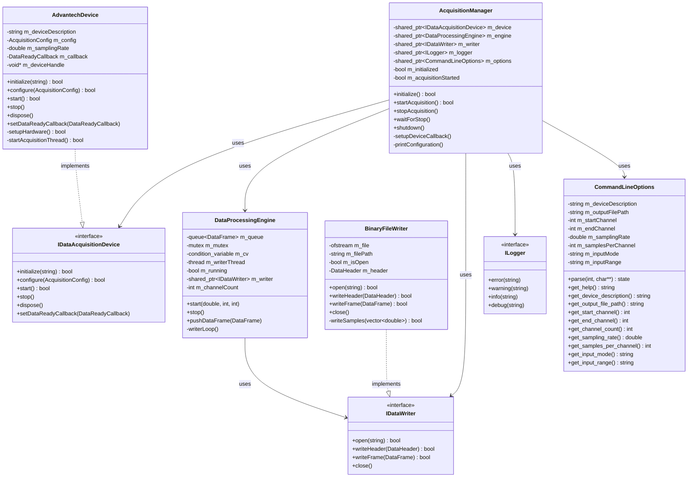
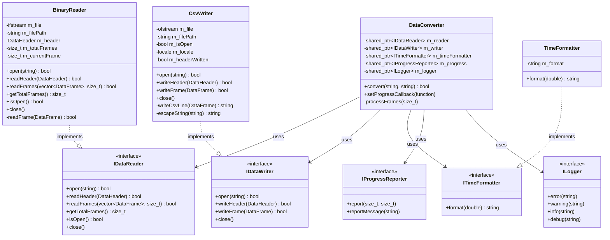
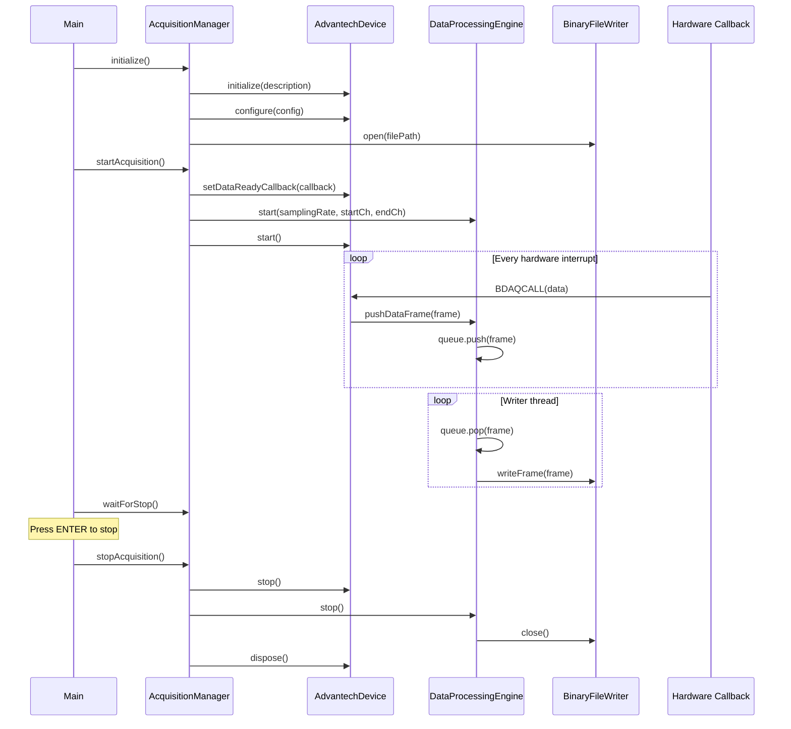
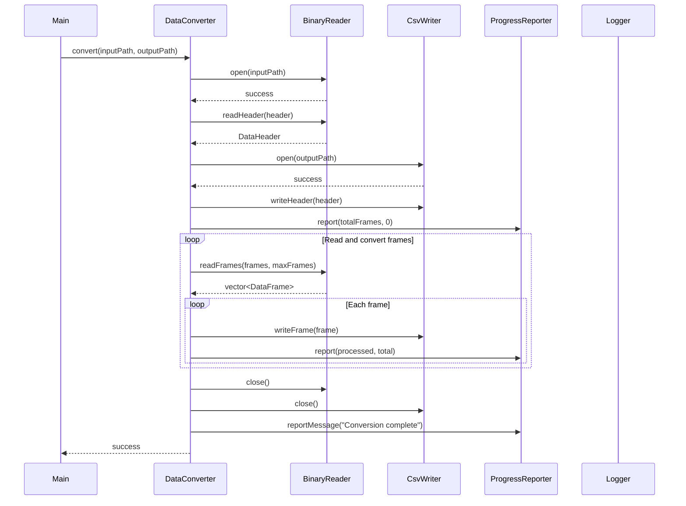

# PCI-1715 Data Acquisition System

C++ application suite for high-speed data acquisition (up to 500 kHz) using the **Advantech PCI-1715** analog input card with galvanic isolation.

## Overview

The project consists of two main applications:

- **`data-logger`** — Real-time data acquisition with hardware-triggered sampling, writes binary files
- **`data-converter`** — Converts binary acquisition files to CSV format with timestamps

Both applications are built with C++17 and use the Advantech DAQNavi SDK for hardware control.

## Features

- **High-speed acquisition** — Up to 500 kHz sampling rate
- **Multi-channel support** — Up to 32 single-ended or 16 differential channels
- **Galvanic isolation** — 2500 VDC isolation for industrial safety
- **Real-time processing** — Callback-based data streaming with queue buffering
- **Binary storage** — Compact, fast binary format with header metadata
- **CSV export** — Converter generates CSV with Russian locale (comma decimal separator)
- **Interactive launcher** — `run.bat` provides a menu-driven interface

## Hardware Requirements

- **Device:** Advantech PCI-1715 / PCI-1715U
- **Interface:** PCI (5V)
- **SDK:** Advantech DAQNavi (included in `library/`)
- **Resolution:** 12-bit ADC
- **FIFO Buffer:** 1024 samples

## Build Instructions

### Interactive Build

Run the interactive build script:

```batch
build.bat
```

You'll be prompted to select:
- **Configuration:** Release or Debug
- **Architecture:** Win32 or x64
- **Toolset:** VS version (v140_xp, v141, v142, v143, ClangCL)

### Manual Build

```bash
mkdir build && cd build
cmake .. -G "Visual Studio 17 2022" -A x64
cmake --build . --config Release
```

### Outputs

- `build/application/data-logger/Release/data-logger.exe`
- `build/application/data-converter/Release/data-converter.exe`

## Running the Applications

### Interactive Launcher (Recommended)

```batch
run.bat
```

Provides a menu-driven interface with prompts and validation for all parameters.

### Data Logger (Direct)

```bash
data-logger.exe --device PCI-1715,BID#0 --start-channel 0 --end-channel 31 --rate 100000 --input-mode unipolar --input-range 10V --output data.bin
```

#### Command-Line Arguments

| Argument | Description | Default |
|----------|-------------|---------|
| `--device` | Device description (e.g., `PCI-1715,BID#0`) | `DemoDevice,BID#0` |
| `--start-channel` | First channel (0-31) | `0` |
| `--end-channel` | Last channel (0-31) | `31` |
| `--rate` | Sampling rate in Hz (max 500000) | `500000` |
| `--samples-per-channel` | Buffer size per channel | `10240` |
| `--output` | Output binary file name | `daq_data.bin` |
| `--input-mode` | `bipolar` or `unipolar` | `unipolar` |
| `--input-range` | `10V`, `5V`, `2.5V` | `10V` |

### Data Converter

```bash
data-converter.exe --input data.bin --output data.csv
```

## Architecture

### UML Diagrams

#### Data Logger Class Diagram



#### Data Converter Class Diagram



#### Data Logger Sequence Diagram (Acquisition Flow)



#### Data Converter Sequence Diagram (Conversion Flow)



### Data Logger

The data logger uses a three-thread architecture:

1. **Main Thread** — Controls the acquisition lifecycle (start/stop)
2. **Callback Thread** — Hardware interrupt handler (`BDAQCALL`), pushes data to queue
3. **Writer Thread** — Reads from queue, writes to binary file

### Key Components

| Component | Purpose |
|-----------|---------|
| `IDataAcquisitionDevice` | Hardware abstraction interface |
| `AdvantechDevice` | PCI-1715 implementation using DAQNavi SDK |
| `DataProcessingEngine` | Queue management and frame assembly |
| `BinaryFileWriter` | Binary file output with header |
| `AcquisitionManager` | Orchestrates device, engine, and writer |

### Data Format

Binary files contain a `DataHeader` struct followed by raw `double` samples per channel:

```cpp
struct DataHeader {
    uint32_t magic;           // File signature
    uint32_t version;         // Format version
    double samplingRate;      // Samples per second
    uint32_t startChannel;    // First channel
    uint32_t endChannel;      // Last channel
    uint32_t channelCount;    // Total channels
    double startTimeSeconds;  // Acquisition start time
    double endTimeSeconds;    // Acquisition end time
};
```

## Development

### Prerequisites

- **Windows** (only, due to DAQNavi SDK)
- **Visual Studio 2022** (or compatible)
- **CMake** 3.20 or higher
- **Advantech DAQNavi SDK** (included in `library/`)

### Project Structure

```
pci-1715/
├── AGENTS.md                 # AI agent instructions
├── build.bat                 # Interactive build script
├── CMakeLists.txt            # Root CMake configuration
├── run.bat                   # Interactive launcher
├── application/
│   ├── data-logger/          # Acquisition application
│   │   ├── core/             # Core components
│   │   ├── devices/          # Device implementations
│   │   ├── main/             # Entry point
│   │   └── storage/          # File I/O
│   └── data-converter/       # Conversion utility
│       ├── core/             # Reader/writer interfaces
│       ├── factory/          # Factory patterns
│       └── main/             # Entry point
└── library/
    └── DAQNavi/              # Advantech SDK
        ├── inc/              # Headers
        └── src/              # Source
```

### Build Configuration

- **C++ Standard:** C++17
- **MSVC Runtime:** Static linking (`/MT` for Release, `/MTd` for Debug)
- **Target Platform:** Windows only

## Common Pitfalls

1. **Callback must not block** — The `BDAQCALL` callback runs on a high-priority thread. Never perform I/O, heap allocations, or long operations inside it — only push data to the queue.

2. **CSV locale** — The converter outputs CSV with Russian locale (comma decimal separator). Ensure your parsing tools handle this correctly.

3. **Binary file format** — The binary file includes a `DataHeader` struct at the beginning. Don't treat the file as raw `double` samples only — read the header first.

4. **Device description** — The device string format is `PCI-1715,BID#0` (bus ID 0). Adjust the BID number if you have multiple cards.

5. **FIFO buffer** — The PCI-1715 has a 1024-sample FIFO. The default buffer size of 10240 samples per channel provides a 10x safety margin.

## License

This project is licensed under the MIT License. See the [LICENSE](LICENSE) file for details.
